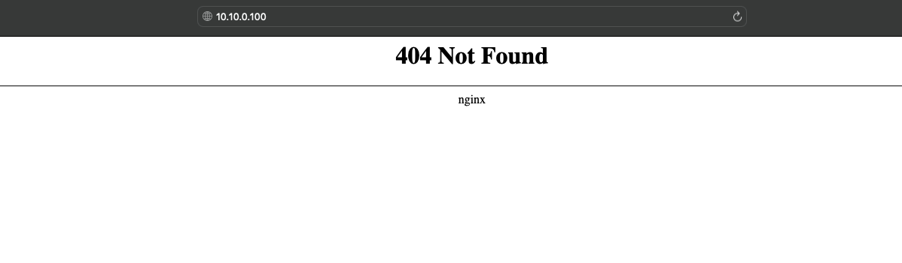
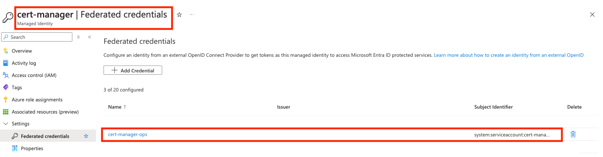
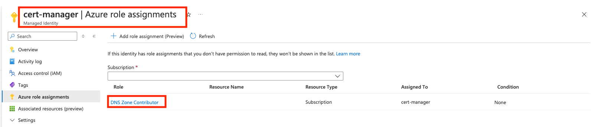
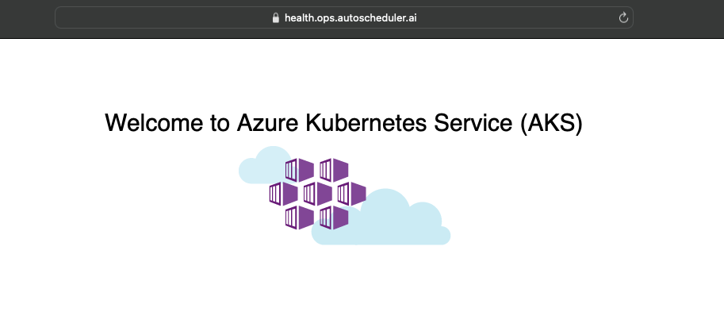

# NGINX Ingress with Cert-Manager & Workload Identity for SSL Automation

This guide provides a comprehensive walkthrough of deploying NGINX Ingress on Kubernetes with an internal IP address, setting up cert-manager for automated certificate generation, and managing secrets securely using Azure Workload Identity. It also covers the implementation of health checks for deployed services and testing SSL certificate generation through cert-manager. The document is designed for users looking to automate certificate management and secure ingress traffic in internal Kubernetes environments.

- [NGINX Ingress with Cert-Manager & Workload Identity for SSL Automation](#nginx-ingress-with-cert-manager---workload-identity-for-ssl-automation)
  - [Assuming You Have](#assuming-you-have)
  - [Use Case](#use-case)
    - [What We will be covering](#what-we-will-be-covering)
  - [Install Ingress-Nginx](#install-ingress-nginx)
    - [Installing the nginx Helm-chart](#installing-the-helm-chart)
    - [Verify Ingress SVC](#verify-ingress-svc)
  - [Installing cert-manager with Azure DNS Zone and Managed Identities](#installing-cert-manager-with-azure-dns-zone-and-managed-identities)
    - [Enable OIDC issuer for your Cluster](#enable-oidc-issuer-for-your-cluster)
    - [Create a Workload Identity](#create-a-workload-identity)
    - [Create a Federated Credetials](#create-a-federated-credetials)
    - [Assing the Role DNS Zone Contributor](#assing-the-role-dns-zone-contributor)
    - [Get Cert Manager Helm Chart](#get-cert-manager-helm-chart)
    - [Installing CRDS for cert Manager](#installing-crds-for-cert-manager)
    - [Create Namespace & Install cert-manager](#create-namespace---install-cert-manager)
      - [Create a Cluster Issuer](#create-a-cluster-issuer)
      - [Generate a test certificate](#generate-a-test-certificate)
  - [Testing cert-generation and ingress](#testing-cert-generation-and-ingress)
    - [Cert Manager Annotations](#cert-manager-annotations)
      - [Verify the SSL](#verify-the-ssl)

## Assuming You Have

- [ ] A Kubernetes Cluster
- [ ] A DNS Zone Created in Azure for DNS Management
- [ ] NS Records Propageted to your Azure DNS Zone

## Use Case

Assume You have company domain name registered `xyz.com` at any Domain Registrar e.g Godaddy, Namecheap, Cloudflare etc.

- You are required to create a dev cluster and run services for dev in an internal network with ingress and ssl.
- Create a dns zone in azure named dev.xyz.com and fetch `<Name server 1>`

| Type     | Host    | Value           | TTL       |
|----------|---------|-----------------|-----------|
| NS Record|  dev    | <Name server 1> | Automatic |

## What We will be covering

- [x] Installing Ingress-Nginx
- [x] Installing cert-manager with Azure Private DNS Zone
  - [x] Creating a workload Identity i.e Managed Identities
  - [x] Creating Federated Identity Credentials
  - [x] Providiing Permissions to Workload Identity
- [x] Testing cert-generation and ingress

We will setup using Azure, Other Cloud platforms follow the same process.

### Install Ingress-Nginx

```bash

# Get the Helm Repo for Ingress
helm repo add ingress-nginx https://kubernetes.github.io/ingress-nginx

helm search repo ingress-nginx
#   NAME                            CHART VERSION   APP VERSION     DESCRIPTION                                       
#   ingress-nginx/ingress-nginx     4.11.2          1.11.2          Ingress controller for Kubernetes using NGINX a...

# Pull the helm chart
helm pull ingress-nginx/ingress-nginx

# Extract
tar -xvf ingress-nginx-4.11.2.tgz

# Remove the tar.
rm -rf ingress-nginx-4.11.2.tgz
```

I like to create my own helm charts and pull relevant versions and keep them in my repository instead of deploying from the online helm chart repository.

#### Installing the Helm-chart

We are deploying this in Azure, for AWS and GCP similar annotations can be added,
I like to add a custom easy to remember IP address, and using internal IP address for Nginx Depends on the organization need.

```YAML
controller:
  service:
    loadBalancerIP: "10.10.10.100"  # Replace with your reserved IP address For Private VNet make sure to use from the subnet range.
    annotations:
      service.beta.kubernetes.io/azure-load-balancer-internal: "true" # If you want to keep Ingress Public comment this line.
      service.beta.kubernetes.io/azure-load-balancer-health-probe-request-path: "/healthz" # Setting health probe path will let default azure health checks to return healthy.  
      service.beta.kubernetes.io/azure-dns-label-name: "<organizationname>-<env>-aks-001-ingress" # I like to label its easier to identify
```

```bash
# Create the namespace
kubectl create ns ingress-nginx

# Deploy Ingress Controller
helm upgrade --install ingress-nginx ./ingress-nginx -f values-ingress.yaml -n ingress-nginx
```

#### Verify Ingress SVC

```bash
cert-manager-ingress-k8s-helm git:(main) ✗ kubectl get all  -n ingress-nginx
NAME                                            READY   STATUS    RESTARTS   AGE
pod/ingress-nginx-controller-59ff46fdb6-sw8vn   1/1     Running   0          40d

NAME                                         TYPE           CLUSTER-IP     EXTERNAL-IP   PORT(S)                      AGE
service/ingress-nginx-controller             LoadBalancer   10.0.189.224   10.10.10.100     80:31457/TCP,443:30737/TCP   49d
service/ingress-nginx-controller-admission   ClusterIP      10.0.191.182   <none>        443/TCP                      49d

NAME                                       READY   UP-TO-DATE   AVAILABLE   AGE
deployment.apps/ingress-nginx-controller   1/1     1            1           49d

NAME                                                  DESIRED   CURRENT   READY   AGE
replicaset.apps/ingress-nginx-controller-59ff46fdb6   1         1         1       49d
replicaset.apps/ingress-nginx-controller-f44b59fbb    0         0         0       40d
```

You should get like this opening it in the browser.


### Installing cert-manager with Azure Private DNS Zone and Managed Identities

#### Enable OIDC issuer for your Cluster

```bash
export CLUSTER_NAME="<YourClusterNameGoesHere>"
export RESOURCE_GROUP="<ClusterResourceGroup>"

#### Enable OIDC Issuer
az aks update \
    --resource-group "${RESOURCE_GROUP}" \
    --name "${CLUSTER_NAME}" \
    --enable-oidc-issuer \
    --enable-workload-identity
```

#### Create a Workload Identity

You can Create Workload Identity in any Resource Group, Subscription.

```bash
export IDENTITY_RESOURCE_GROUP="<YourIdentityResourceGroupName>"
export IDENTITY_NAME="cert-manager"
export IDENTITY_RESOURCE_GROUP="<IdentityResourceGroup>"

## Assuming you're already logged to your Azure Account and set your subscription if not do:
## Run az login and set your subscription.

# This will Create your managed Identity.
az identity create --name "${IDENTITY_NAME}" --resource-group "${IDENTITY_RESOURCE_GROUP}"
```

#### Create a Federated Credetials

We will fetch `IDENTIY_CLIENT_ID` The identity created in last step.<br>
We will fetch the `SERVICE_ACCOUNT_ISSUER` This will be service account used by vault.

```bash
# Create Federated Credential
export SERVICE_ACCOUNT_NAME=cert-manager # ℹ️ This is the default Kubernetes ServiceAccount used by the vault
export SERVICE_ACCOUNT_NAMESPACE=cert-manager # ℹ️ This is the namespace for vault service account.
export SERVICE_ACCOUNT_ISSUER=$(az aks show --resource-group $RESOURCE_GROUP --name $CLUSTER_NAME --query "oidcIssuerProfile.issuerUrl" -o tsv)
export IDENTITY_CLIENT_ID=$(az identity show --name "${IDENTITY_NAME}" --resource-group "${IDENTITY_RESOURCE_GROUP}"  --query 'clientId' -o tsv)

# Create Federated Credential
az identity federated-credential create \
  --name "cert-manager-ops" \
  --identity-name "${IDENTITY_NAME}" \
  --resource-group "${IDENTITY_RESOURCE_GROUP}" \
  --issuer "${SERVICE_ACCOUNT_ISSUER}" \
  --subject "system:serviceaccount:${SERVICE_ACCOUNT_NAMESPACE}:${SERVICE_ACCOUNT_NAME}"
```

This should appear in your managed identities like this.

#### Assing the Role DNS Zone Contributor

Now you need to assign the role to your managed Identity

- **Using cli**

```bash
export DOMAIN_NAME="dev.xyz.com"

# Get Client ID of the managed identity
export IDENTITY_CLIENT_ID=$(az identity show \
    --name "${IDENTITY_NAME}" \
    --resource-group "${IDENTITY_RESOURCE_GROUP}" \
    --query 'clientId' -o tsv)

# Assign the "DNS Zone Contributor" role to the managed identity
az role assignment create \
    --role "DNS Zone Contributor" \
    --assignee $IDENTITY_CLIENT_ID \
    --scope $(az network dns zone show --name $DOMAIN_NAME --resource-group "${RESOURCE_GROUP}" -o tsv --query id)
```

- **Using the Azure Portal**



#### Get Cert Manager Helm Chart

```bash
# Add Helm chart
helm repo add jetstack https://charts.jetstack.io

# Search Versions
helm search repo jetstack

# | NAME                                    | CHART VERSION   | APP VERSION | DESCRIPTION                                      |
# |-----------------------------------------|-----------------|-------------|--------------------------------------------------|
# | jetstack/cert-manager                   | v1.15.3         | v1.15.3     | A Helm chart for cert-manager                    |
# | jetstack/cert-manager-approver-policy   | v0.15.1         | v0.15.1     | approver-policy is a CertificateRequest approver  |
# | jetstack/cert-manager-csi-driver        | v0.10.0         | v0.10.0     | cert-manager csi-driver enables issuing secret... |
# | jetstack/cert-manager-csi-driver-spiffe | v0.8.0          | v0.8.0      | csi-driver-spiffe is a Kubernetes CSI plugin      |

# Pull the helm chart
helm pull jetstack/cert-manager 

# Extract
tar -xvf cert-manager-v1.15.3.tgz

# Remove the tar.
rm -rf cert-manager-v1.15.3.tgz
```

#### Installing CRDS for cert Manager

Make sure to use the same version as `chart version` in our case its `v1.15.3`

```bash
kubectl apply -f https://github.com/cert-manager/cert-manager/releases/download/v1.15.3/cert-manager.crds.yaml
```

#### Create Namespace & Install cert-manager

```bash
# create the namespace
kubectl create ns cert-manager

# deploy cert manager
helm upgrade --install cert-manager ./cert-manager -f cert-manager/values-cert-manager.yaml -n cert-manager
```

##### Create a Cluster Issuer

```YAML
apiVersion: cert-manager.io/v1
kind: ClusterIssuer
metadata:
  name: letsencrypt
spec:
  acme:
    server: https://acme-v02.api.letsencrypt.org/directory
    email: support@xyz.com
    privateKeySecretRef:
      name: letsencrypt
    solvers:
    - dns01:
        azureDNS:
          hostedZoneName: "dev.xyz.com"
          resourceGroupName: "${RESOURCE_GROUP}"
          subscriptionID: "${SUBSCRIPTION_ID}"
          environment: AzurePublicCloud
          managedIdentity:
            clientID: "${IDENTITY_CLIENT_ID}"
```

You need to deploy the cluster issuer

```bash
kubectl apply -f checks/cluster-issuer.yaml
```

##### Generate a test certificate

```YAML
apiVersion: cert-manager.io/v1
kind: Certificate
metadata:
  name: dev-xyz-com
  namespace: cert-manager
spec:
  secretName: dev-xyz-com-tls
  privateKey:
    rotationPolicy: Always
  dnsNames:
  - "dev.xyz.com"
  - "*.dev.xyz.com"
  issuerRef:
    name: letsencrypt
    kind: ClusterIssuer
    group: cert-manager.io
```

You can test the certificate by running

```bash
kubectl apply -f checks/certificate.yaml

kubectl get certificates -n cert-manager
# NAME                    READY   SECRET                  AGE
# dev-xyz-com             True    dev-xyz-com-tls         48s
```

##### Testing cert-generation and ingress

Here is simple `deployment.yaml`

```YAML
apiVersion: apps/v1
kind: Deployment
metadata:
  name: health-check  
  namespace: cert-manager
spec:
  replicas: 1
  selector:
    matchLabels:
      app: health-check
  template:
    metadata:
      labels:
        app: health-check
    spec:
      containers:
      - name: health-check
        image: mcr.microsoft.com/azuredocs/aks-helloworld:v1
        ports:
        - containerPort: 80
        env:
        - name: TITLE
          value: "Welcome to Azure Kubernetes Service (AKS)"
---
apiVersion: v1
kind: Service
metadata:
  name: health-check  
  namespace: cert-manager
spec:
  type: ClusterIP
  ports:
  - port: 80
  selector:
    app: health-check
```

You can use the deployment.yaml file

```bash
# Create namespace
kubectl create ns health-check

# deploy the health check
kubectl apply -f checks/deployment.yaml

kubectl get pods -n health-check
# NAME                            READY   STATUS    RESTARTS   AGE
# health-check-7f8ccdf87f-sq55m   1/1     Running   0          49s
```

##### Cert Manager Annotations

here is a sample `ingress.yaml` which takes care of Certificate Generation and Renewal.

```YAML
apiVersion: networking.k8s.io/v1
kind: Ingress
metadata:
  name: health-check
  namespace: health-check
  annotations:
    cert-manager.io/cluster-issuer: "letsencrypt"
    cert-manager.io/common-name: "health.dev.xyz.com"    
spec:
  ingressClassName: nginx
  tls:
  - hosts:
    - health.dev.xyz.com
    secretName: dev-xyz-com-tls
  rules:
    - host: health.dev.xyz.com
      http:
        paths:
          - path: /
            pathType: Prefix
            backend:
              service:
                name: health-check
                port:
                  number: 80
    - host: health.dev.xyz.com
      http:
        paths:
          - path: /static
            pathType: Prefix
            backend:
              service:
                name: health-check
                port: 
                  number: 80
```

###### Verify the SSL


